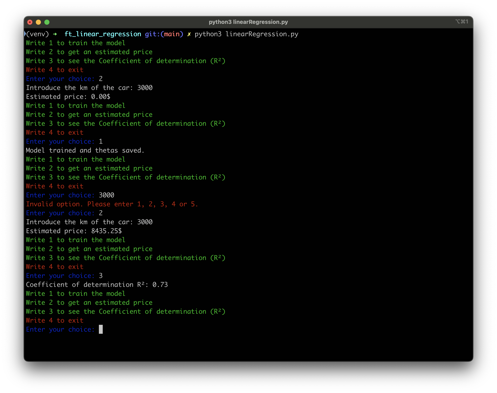
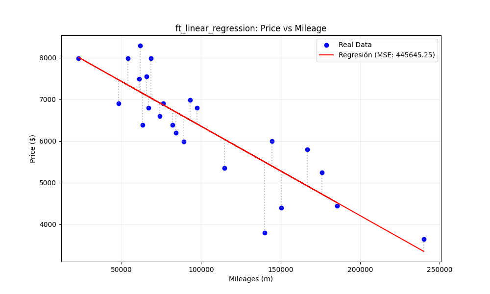

<div align="center">
<h1 align="center">
    <br>ft_linear_regression</br>
</h1>
<p align="center">
    
</p>
</div>

## Table of Contents
- [📄 Summary](#-summary)
- [🧠 Project breakdown](#-project-breakdown)
- [✅ Mandatory functionalities](#-mandatory-functionalities)
- [🚀 Usage](#-usage)
- [🖼️ Screenshots](#-screenshots)
- [📦 Installation](#-installation)

---

## 📄 Summary

This project is a simple machine learning algorithm to predict the price of a car based on its mileage using **linear regression**. It includes both training and inference scripts, visualization of the result, and evaluation metrics like **Mean Squared Error (MSE)** and **R² score**.

The learning algorithm is implemented **from scratch**, without using high-level libraries like `numpy.polyfit`, staying true to the pedagogical spirit of the project.

---

## 🧠 Project breakdown

The project is split into the following components:

- `train_model`: Trains the model using gradient descent.
- `estimate_price`: Asks the user for mileage input and estimates the car price.
- `mse` & `r_square`: Evaluate model accuracy.
- `draw`: Plots real data and regression line.
- `utilsData.py`: Manages I/O, thetas, and data persistence.
- `algorithmsRegression.py`: Hosts the gradient descent and evaluation logic.

---

## ✅ Mandatory functionalities

- Implementation of **linear regression** using:
  estimatePrice(mileage) = θ0 + (θ1 * mileage)

- Gradient descent algorithm to update `θ0` and `θ1`.
- Persistent storage of thetas between runs.
- Prediction based on user input.
- CLI interface for training and predicting.

---

## 🖼️ Screenshots





---

## 🚀 Usage

Run the program from the root directory:

```bash
python3 -m venv .venv
source .venv/bin/activate
pip install -r requirements.txt
python3 linear_regression.py
